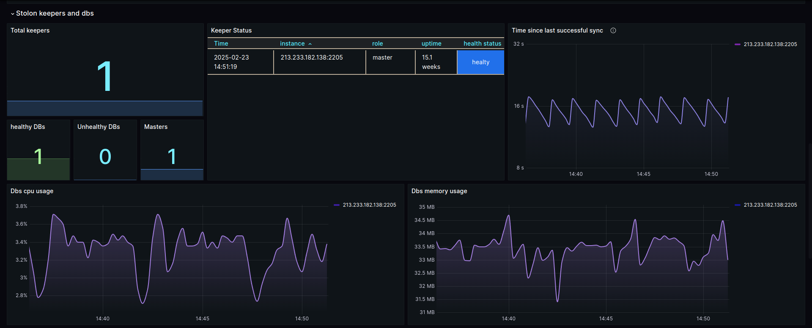
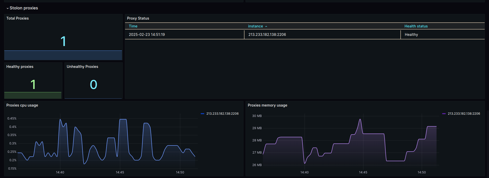
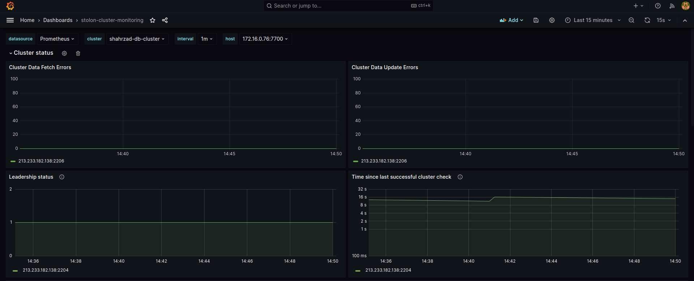

# Stolon Grafana Dashboard
 



# what is stolon?
stolon is a cloud native PostgreSQL manager for PostgreSQL high availability. It's cloud native because it'll let you keep an high available PostgreSQL inside your containers (kubernetes integration) but also on every other kind of infrastructure (cloud IaaS, old style infrastructures etc...)
[stolon official github](https://github.com/sorintlab/stolon)

# what dose this dashboard do?
This is a simple Grafana dashboard developed for monitoring the status of various Stolon components (Keeper, Proxy, Sentinel, etc.). It allows for analyzing the behavior of the database cluster, ensuring its proper functioning, and setting up alert rules when needed.

# how to use it?
first of all, you need to install prometheus and grafana
you can use this docker compose file

```
version: '3.7'

services:
  prometheus:
    image: prom/prometheus:latest
    container_name: prometheus
    volumes:
      - ./prometheus.yml:/etc/prometheus/prometheus.yml
    ports:
      - "9090:9090"
    networks:
      - monitoring
    restart: always

  grafana:
    image: grafana/grafana:latest
    container_name: grafana
    environment:
      - GF_SECURITY_ADMIN_PASSWORD=admin
    ports:
      - "3000:3000"
    depends_on:
      - prometheus
    networks:
      - monitoring
    restart: always

networks:
  monitoring:
    driver: bridge

```
### config prometheus

then use the content of prometheus.yml file and change the IP addresses and ports for your components
```
- job_name: 'stolon-database-cluster'
  static_configs:
    - targets: ['<stolon-component-ip>:<metric-exporter-ip>']

```


### import dashboard
create a dashboard in your grafana and import json model
